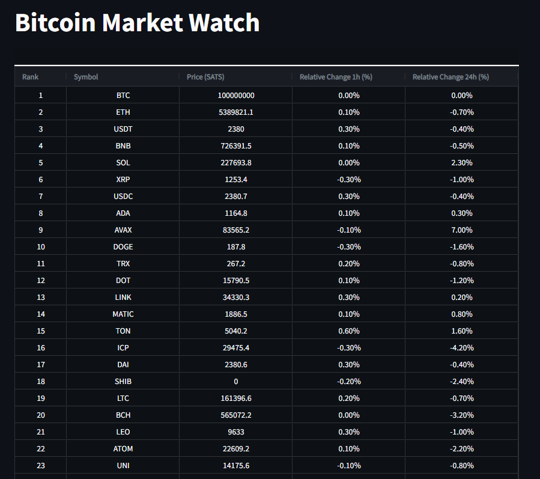

# BitcoinMarketWatch
This project provides real-time price data, expressed in Bitcoin, for a wide range of altcoins, offering users valuable insights into the world of digital assets.

To run the code

Install 

pip install python-dotenv   
pip install requests pandas
pip install pandas

Create a .env file with this format

CMC_API_KEY= 'your-coinmarketap-apikey'

Run the code with 

"python main.py" 

The result is a table like this in a .csv file 

