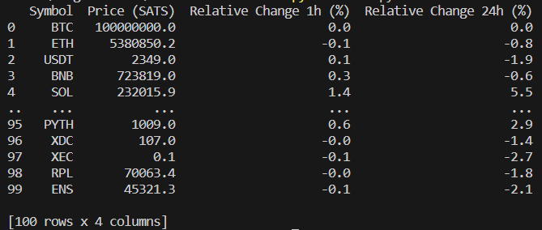

# BitcoinMarketWatch

This project provides real-time price data, expressed in Bitcoin, for a wide range of altcoins, offering users valuable insights into the world of digital assets.

## Getting Started

### Prerequisites

Before running this project, you need to install the required Python libraries:

`
pip install python-dotenv
requests
pandas
`

### Installation
1. Clone the repository to your local machine:

`git clone https://github.com/arkanoeth/BitcoinMarketWatch`  

2. Navigate to the cloned repository:

`cd BitcoinMarketWatch`

3. Create a .env file in the root directory of the project with the following content:

CMC_API_KEY= 'your-coinmarketap-apikey'

Replace 'your-coinmarketcap-apikey' with your actual CoinMarketCap API key.

### Running the code

Execute the script using Python:

` python main.py`

## Output

The script will generate a .csv file containing a table with the price data. The table is structured like this:

Note: The table above is just an example; the actual output will vary according to real-time market data

